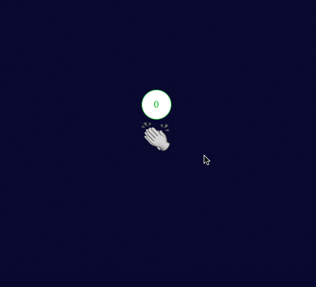

![Built With Stencil](https://img.shields.io/badge/-Built%20With%20Stencil-16161d.svg?logo=data%3Aimage%2Fsvg%2Bxml%3Bbase64%2CPD94bWwgdmVyc2lvbj0iMS4wIiBlbmNvZGluZz0idXRmLTgiPz4KPCEtLSBHZW5lcmF0b3I6IEFkb2JlIElsbHVzdHJhdG9yIDE5LjIuMSwgU1ZHIEV4cG9ydCBQbHVnLUluIC4gU1ZHIFZlcnNpb246IDYuMDAgQnVpbGQgMCkgIC0tPgo8c3ZnIHZlcnNpb249IjEuMSIgaWQ9IkxheWVyXzEiIHhtbG5zPSJodHRwOi8vd3d3LnczLm9yZy8yMDAwL3N2ZyIgeG1sbnM6eGxpbms9Imh0dHA6Ly93d3cudzMub3JnLzE5OTkveGxpbmsiIHg9IjBweCIgeT0iMHB4IgoJIHZpZXdCb3g9IjAgMCA1MTIgNTEyIiBzdHlsZT0iZW5hYmxlLWJhY2tncm91bmQ6bmV3IDAgMCA1MTIgNTEyOyIgeG1sOnNwYWNlPSJwcmVzZXJ2ZSI%2BCjxzdHlsZSB0eXBlPSJ0ZXh0L2NzcyI%2BCgkuc3Qwe2ZpbGw6I0ZGRkZGRjt9Cjwvc3R5bGU%2BCjxwYXRoIGNsYXNzPSJzdDAiIGQ9Ik00MjQuNywzNzMuOWMwLDM3LjYtNTUuMSw2OC42LTkyLjcsNjguNkgxODAuNGMtMzcuOSwwLTkyLjctMzAuNy05Mi43LTY4LjZ2LTMuNmgzMzYuOVYzNzMuOXoiLz4KPHBhdGggY2xhc3M9InN0MCIgZD0iTTQyNC43LDI5Mi4xSDE4MC40Yy0zNy42LDAtOTIuNy0zMS05Mi43LTY4LjZ2LTMuNkgzMzJjMzcuNiwwLDkyLjcsMzEsOTIuNyw2OC42VjI5Mi4xeiIvPgo8cGF0aCBjbGFzcz0ic3QwIiBkPSJNNDI0LjcsMTQxLjdIODcuN3YtMy42YzAtMzcuNiw1NC44LTY4LjYsOTIuNy02OC42SDMzMmMzNy45LDAsOTIuNywzMC43LDkyLjcsNjguNlYxNDEuN3oiLz4KPC9zdmc%2BCg%3D%3D&colorA=16161d&style=flat-square)

# Claps button web component 

<p class="codepen" data-height="383" data-theme-id="29194" data-default-tab="result" data-user="arvin0731" data-slug-hash="ExjGBNq" style="height: 383px; box-sizing: border-box; display: flex; align-items: center; justify-content: center; border: 2px solid; margin: 1em 0; padding: 1em;" data-pen-title="claps-button web component">
  <span>See the Pen <a href="https://codepen.io/arvin0731/pen/ExjGBNq">
  claps-button web component</a> by Arvin (<a href="https://codepen.io/arvin0731">@arvin0731</a>)
  on <a href="https://codepen.io">CodePen</a>.</span>
</p>



## Develop

```bash
npm install
npm start
```

To build the component for production, run:

```bash
npm run build
```

To run the unit tests for the components, run:

```bash
npm test
```

## Using this component


### Script tag

- Put a script tag similar to this `<script src='https://unpkg.com/claps-button@0.0.1/dist/mycomponent.js'></script>` in the head of your index.html
- Then you can use the element anywhere in your template, JSX, html etc

```html
<!--in your index.html-->
<script src='https://unpkg.com/claps-button@1.0.7/dist/claps-button.js'></script>
<!-- // other code -->
```
**You can change size and color by passing them as props**

```html
<claps-button size="5rem" color="#ffe000"></claps-button>
```

**If you want to perserve the claps number, you can pass `preserve` as props, it'll save to localstorage with `claps-wc-${location.pathname}` as key.**

```html
<claps-button size="3rem" preserve ></claps-button>
```

### Node Modules
- Run `npm install claps-button --save`
- Put a script tag similar to this `<script src='node_modules/claps-button/dist/mycomponent.js'></script>` in the head of your index.html
- Then you can use the element anywhere in your template, JSX, html etc

### In a stencil-starter app
- Run `npm install claps-button --save`
- Add an import to the npm packages `import claps-button;`
- Then you can use the element anywhere in your template, JSX, html etc

# Built by Stencil

Stencil is a compiler for building fast web apps using Web Components.

Stencil combines the best concepts of the most popular frontend frameworks into a compile-time rather than run-time tool.  Stencil takes TypeScript, JSX, a tiny virtual DOM layer, efficient one-way data binding, an asynchronous rendering pipeline (similar to React Fiber), and lazy-loading out of the box, and generates 100% standards-based Web Components that run in any browser supporting the Custom Elements v1 spec.

Stencil components are just Web Components, so they work in any major framework or with no framework at all.
